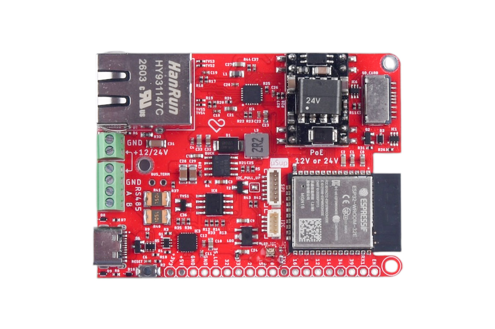
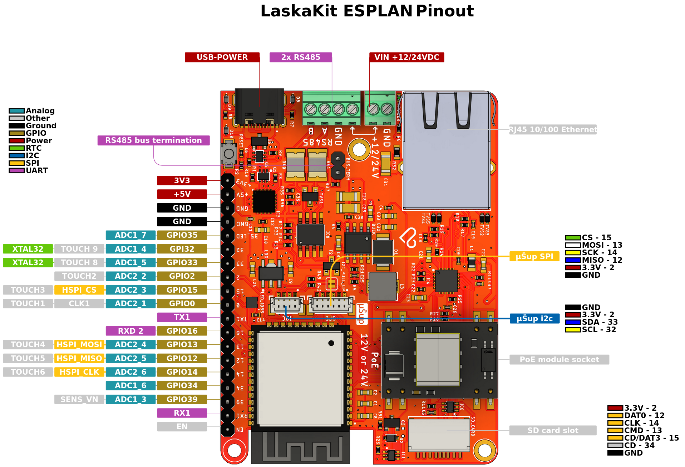

# ESPlan v2.1

**Jiné jazyky: [English](README.md)**



**LaskaKit ESPlan** je průmyslová vývojová deska postavená na modulu **ESP32-WROOM-32E**. Kombinuje drátový **Ethernet (LAN8720A)**, sběrnici **RS485**, **Wi-Fi + Bluetooth** a **tři nezávislé způsoby napájení** – včetně volitelného **PoE**. Deska je určena pro průmyslovou automatizaci, IoT brány, domácí automatizaci (Home Assistant, ESPHome) i vzdálené senzorové uzly, kde je potřeba spolehlivá kabelová konektivita bez závislosti na Wi-Fi.

Navrženo a vyrobeno v ČR 🇨🇿

Stránka produktu: <https://www.laskakit.cz/laskakit-esplan-esp32-lan8720a-max485-poe/>

---

## ⚡ Napájení – tři možnosti

ESPlan v2.1 podporuje tři zdroje napájení, které lze libovolně kombinovat. Vždy je aktivní ten s **nejvyšším napětím**.

| Zdroj | Vstupní napětí | Cesta na desku | Typické použití |
| --- | --- | --- | --- |
| **USB-C** | 5 V | přímo na 5V větev | vývoj, programování |
| **Šroubovací svorkovnice (+12/24 V, GND)** | **7–40 V DC** (doporučeno 12 nebo 24 V) | step-down **LMR14050** (až 5 A) → 5 V → LDO **XC6220** → 3,3 V | průmyslový zdroj, DIN lišta |
| **PoE (Power over Ethernet)** | přes volitelný modul **SDaPo DP9900M** (varianta 12 V nebo 24 V, **kupuje se zvlášť**) | výstup PoE modulu → stejný buck měnič jako svorkovnice | napájení přímo z LAN kabelu |

> **Poznámka k PoE:** Doporučujeme variantu DP9900M **24 V** – lépe odpovídá vstupnímu rozsahu měniče a má vyšší účinnost. Modul splňuje **IEEE 802.3af** (až 12,95 W), má galvanické oddělení a pracuje s libovolným PoE switchem nebo injektorem.

Celý napájecí řetězec je chráněn: svorkovnicové vstupy jsou jištěny polyfuse, na RS485 sběrnici jsou TVS diody (PSM712) a polyfuse (MF-MSMF010-2) proti přepětí a zkratu z externího vedení.

Anotované obrázky ke každé možnosti najdeš v [`img/power/`](img/power).

---

## 🔌 RS485 – zapojení a napětí na svorkách

Svorkovnice RS485 má **tři vývody: GND, A, B**.

- **A a B nejsou napájecí piny** – nesou diferenciální *datový* signál z transceiveru **WS3081**. V klidu je rozdíl A−B přibližně 0 V; při vysílání je |A−B| zhruba **1,5–3 V** pod zátěží (dle standardu RS485 vysílač generuje ≥1,5 V diferenciálně, přijímač detekuje ±200 mV, common-mode rozsah −7 V až +12 V). **Žádné použitelné napájení na A/B není.**
- **Napájení připojeného RS485 zařízení:** na svorkovnici je navíc vyvedeno **12/24 V IN/OUT**, takže stejné napětí, kterým napájíš ESPlan (12 nebo 24 V), můžeš vyvést ven a napájet jím vzdálené čidlo po stejném vedení. Pokud čidlo potřebuje jiné napětí (např. 5 V), použij u čidla vlastní měnič.
- **Zapojení sběrnice:** propoj **A↔A, B↔B, GND↔GND**. Na konci dlouhého vedení zapni zakončovací odpor **120 Ω** jumperem **BUS_TERM** – externí terminátor není potřeba.

---

## 🌐 Konektivita a rozhraní

- **Ethernet** – PHY LAN8720A (Fast Ethernet 10/100 Mbps), konektor RJ45 HanRun s integrovanými transformátory a stavovými LED.
- **RS485** – transceiver WS3081 s TVS ochranou, šroubovací svorkovnice (GND, A, B), zakončení 120 Ω přes jumper `BUS_TERM`.
- **Wi-Fi + Bluetooth** – vestavěné v ESP32-WROOM-32E (2,4 GHz Wi-Fi 802.11 b/g/n, Bluetooth 4.2 / BLE).
- **microSD karta** – slot přes SPI s detekcí karty.
- **I²C konektor** – dedikovaný 4pinový konektor (3,3 V, GND, SCL, SDA) s pull-up rezistory pro senzory, displeje apod.
- **µSup konektor** – SPI konektor pro volitelný modul superkondenzátoru (µSup) pro krátké zálohování při výpadku napájení.
- **GPIO header** – všechny volné piny ESP32 vyvedeny na osazený header.

---

## 📍 Pinout (v2.1)

| Funkce | GPIO |
| --- | --- |
| **I²C** SDA / SCL | IO33 / IO32 |
| **SPI** MISO / MOSI / CLK / CS | IO12 / IO13 / IO14 / IO15 |
| **microSD** MISO / MOSI / CLK / CS / CD | IO12 / IO13 / IO14 / IO2 / IO34 |
| **Ethernet** MDC / MDIO / NRST / CLK | IO23 / IO18 / IO5 / GPIO17 (out) |
| **Uživatelská LED** (SK6812) | IO0 |
| Pouze vstupní piny | IO34, IO35, IO39 |



### Ovládací prvky a LED

- Tlačítko **RESET** – reset ESP32.
- Tlačítko **IO0 / BOOT** – vstup do režimu nahrávání firmware (RESET + IO0).
- **Stavová LED** (SK6812) na IO0 – programovatelná uživatelská LED.

> **Inicializace Ethernetu (Arduino core 2.x):** hodiny LAN8720A jsou na GPIO17. Ověřené volání:
> ```cpp
> ETH.begin(0, -1, 23, 18, ETH_PHY_LAN8720, ETH_CLOCK_GPIO17_OUT);
> ```
> Na novějších core použij signaturu s pojmenovanými enumy, např. `ETH.begin(ETH_PHY_LAN8720, ETH_ADDR, ETH_MDC_PIN, ETH_MDIO_PIN, ETH_POWER_PIN, ETH_CLOCK_GPIO17_OUT);`
>
> **Inicializace I²C:** `Wire.begin(33, 32);`

---

## 📐 Specifikace

| | |
| --- | --- |
| **MCU** | ESP32-WROOM-32E (Xtensa LX6 dual-core 240 MHz, 4 MB Flash, Wi-Fi + BT) |
| **Ethernet PHY** | LAN8720A-CP, Fast Ethernet 10/100 Mbps |
| **RS485** | WS3081, half-duplex, TVS ochrana, volitelné zakončení 120 Ω |
| **Napájení – USB-C** | 5 V |
| **Napájení – svorkovnice** | 7–40 V DC (doporučeno 12 nebo 24 V) |
| **Napájení – PoE** | IEEE 802.3af přes modul DP9900M (varianta 12 V nebo 24 V, kupuje se zvlášť) |
| **Interní napájecí větve** | 5 V (buck LMR14050, až 5 A) → 3,3 V (LDO XC6220) |
| **microSD** | SPI, konektor s detekcí karty |
| **Programování** | USB-C s on-board USB-UART převodníkem (auto-boot), tlačítka RESET + BOOT |
| **Kompatibilita** | Arduino IDE, ESP-IDF, ESPHome, Tasmota, MicroPython |

---

## 📦 Obsah balení

- 1× LaskaKit ESPlan v2.1

PoE modul (SDaPo DP9900M) a 3D tištěná krabička **nejsou součástí balení** – objednávají se samostatně.

---

## 🖨️ 3D tištěná krabička

STL/3MF soubory krabičky najdeš ve složce [`3D`](3D).

---

## Licence a podpora

Open-source hardware od LaskaKit. Dotazy, chyby i pull requesty vítáme přes záložku [Issues](../../issues).
